# nanoMuse 项目分析报告

> 分析日期: 2026-11-04  
> 项目版本: v1.0.9 (Tiller)  
> 源码位置: `nanoMuse-main/`

---

## 一、项目概述

### 1.1 项目定位

**nanoMuse** 是一个开源的个人 AI Agent 项目，灵感来源于 Meta 的 Muse，旨在为用户提供跨设备的智能助手服务。项目口号是 "an open-source personal agent for every device you own"（属于你每台设备的开源个人代理）。

**核心理念：**
- 个人代理不应只存在于他人的云端
- 用户可以自主部署和运行
- 开源、免费、非营利
- 数据隐私优先

### 1.2 项目信息

| 属性 | 详情 |
|------|------|
| **开源协议** | GPL-3.0-or-later |
| **主要语言** | Python 3.11+, TypeScript, Swift, Kotlin |
| **开发组织** | 浙江大学 (Guangyi Liu, Yong Liu, Jiangning Zhang) |
| **GitHub** | https://github.com/nano-muse/nanoMuse |
| **官网** | https://nanomuse.cn |
| **论文** | arXiv:2610.08699 |
| **发布日期** | 2026-09-25 (首次发布) |
| **Stars** | 2,000+ (截至 2026-10-21) |

### 1.3 支持平台

| 平台 | 最低版本 | 安装包格式 |
|------|----------|------------|
| **Android** | 8.0+ (arm64) | APK |
| **iOS/iPadOS** | iOS 16+ | TestFlight |
| **macOS** | 12+ | DMG (Apple Silicon / Intel) |
| **Windows** | 10+ | EXE |
| **Linux** | x64 | AppImage / deb / tar.gz |
| **Web** | 现代浏览器 | 在线 Demo |

---

## 二、项目架构

### 2.1 系统架构图

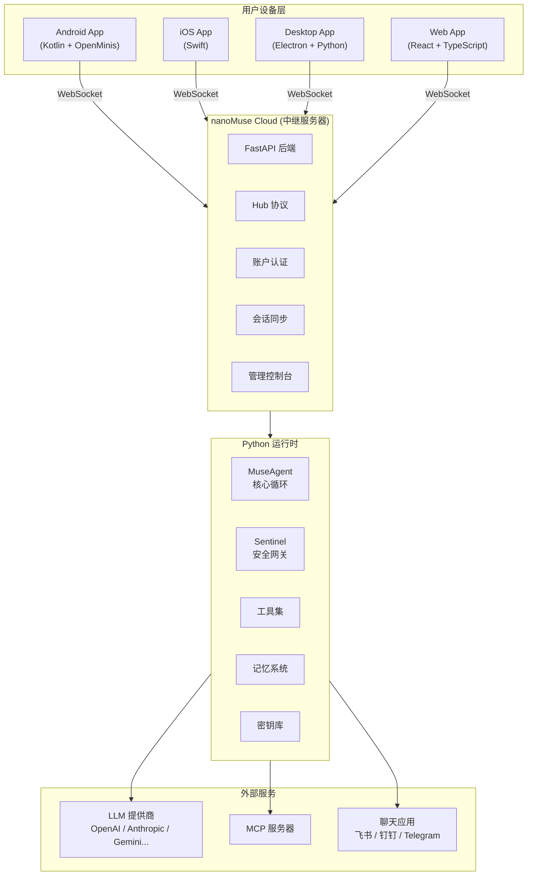
```mermaid
graph TB
    subgraph UserDevices["用户设备层"]
        Android["Android App<br/>(Kotlin + OpenMinis)"]
        iOS["iOS App<br/>(Swift)"]
        Desktop["Desktop App<br/>(Electron + Python)"]
        Web["Web App<br/>(React + TypeScript)"]
    end

    subgraph Relay["nanoMuse Cloud (中继服务器)"]
        API["FastAPI 后端"]
        Hub["Hub 协议"]
        Auth["账户认证"]
        Sync["会话同步"]
        Console["管理控制台"]
    end

    subgraph Runtime["Python 运行时"]
        Agent["MuseAgent<br/>核心循环"]
        Sentinel["Sentinel<br/>安全网关"]
        Tools["工具集"]
        Memory["记忆系统"]
        Vault["密钥库"]
    end

    subgraph External["外部服务"]
        LLM["LLM 提供商<br/>OpenAI / Anthropic / Gemini..."]
        MCP["MCP 服务器"]
        ChatApps["聊天应用<br/>飞书 / 钉钉 / Telegram"]
    end

    Android -->|WebSocket| Relay
    iOS -->|WebSocket| Relay
    Desktop -->|WebSocket| Relay
    Web -->|WebSocket| Relay

    Relay --> Runtime
    Runtime --> LLM
    Runtime --> MCP
    Runtime --> ChatApps
```

### 2.2 设备协作架构图

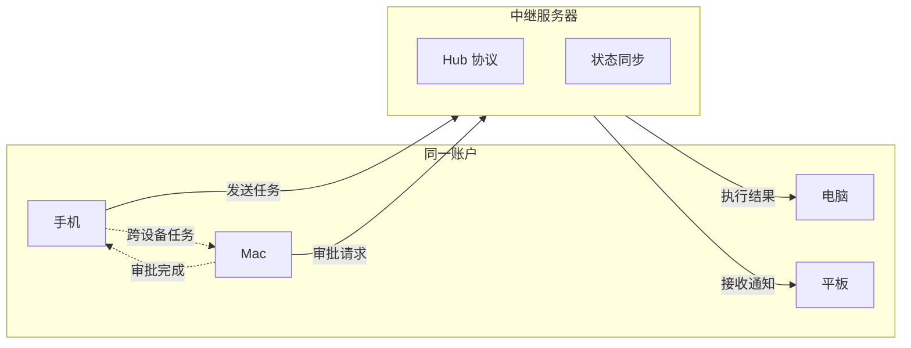
```mermaid
graph LR
    subgraph Account["同一账户"]
        Phone["手机"]
        PC["电脑"]
        Mac["Mac"]
        Tablet["平板"]
    end

    subgraph Relay["中继服务器"]
        Hub["Hub 协议"]
        State["状态同步"]
    end

    Phone -->|发送任务| Relay
    Relay -->|执行结果| PC
    Mac -->|审批请求| Relay
    Relay -->|接收通知| Tablet

    Phone -.->|跨设备任务| Mac
    Mac -.->|审批完成| Phone
```

### 2.3 核心模块图

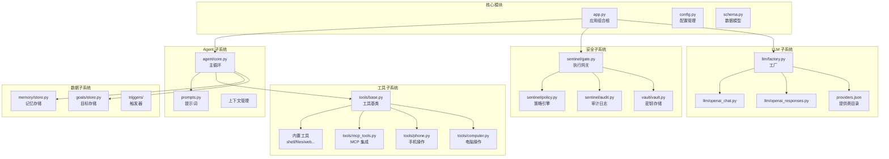
```mermaid
graph TD
    subgraph Core["核心模块"]
        App["app.py<br/>应用组合根"]
        Config["config.py<br/>配置管理"]
        Schema["schema.py<br/>数据模型"]
    end

    subgraph Agent["Agent 子系统"]
        Loop["agent/core.py<br/>主循环"]
        Prompts["prompts.py<br/>提示词"]
        Context["上下文管理"]
    end

    subgraph Security["安全子系统"]
        Gate["sentinel/gate.py<br/>执行网关"]
        Policy["sentinel/policy.py<br/>策略引擎"]
        Audit["sentinel/audit.py<br/>审计日志"]
        VaultMod["vault/vault.py<br/>密钥存储"]
    end

    subgraph ToolsSub["工具子系统"]
        Base["tools/base.py<br/>工具基类"]
        Builtin["内置工具<br/>shell/files/web..."]
        MCP_Tools["tools/mcp_tools.py<br/>MCP 集成"]
        Phone_Tools["tools/phone.py<br/>手机操作"]
        Computer_Tools["tools/computer.py<br/>电脑操作"]
    end

    subgraph LLM_Sub["LLM 子系统"]
        Factory["llm/factory.py<br/>工厂"]
        OpenAI_Chat["llm/openai_chat.py"]
        OpenAI_Resp["llm/openai_responses.py"]
        Providers["providers.json<br/>提供商目录"]
    end

    subgraph Data["数据子系统"]
        Memory_Store["memory/store.py<br/>记忆存储"]
        Goals_Store["goals/store.py<br/>目标存储"]
        Triggers["triggers/<br/>触发器"]
    end

    App --> Loop
    App --> Gate
    App --> Factory
    Loop --> Prompts
    Loop --> Base
    Gate --> Policy
    Gate --> Audit
    Gate --> VaultMod
    Base --> Builtin
    Base --> MCP_Tools
    Base --> Phone_Tools
    Base --> Computer_Tools
    Factory --> OpenAI_Chat
    Factory --> OpenAI_Resp
    Factory --> Providers
    Loop --> Memory_Store
    Loop --> Goals_Store
```

---

## 三、核心流程

### 3.1 Agent 执行流程

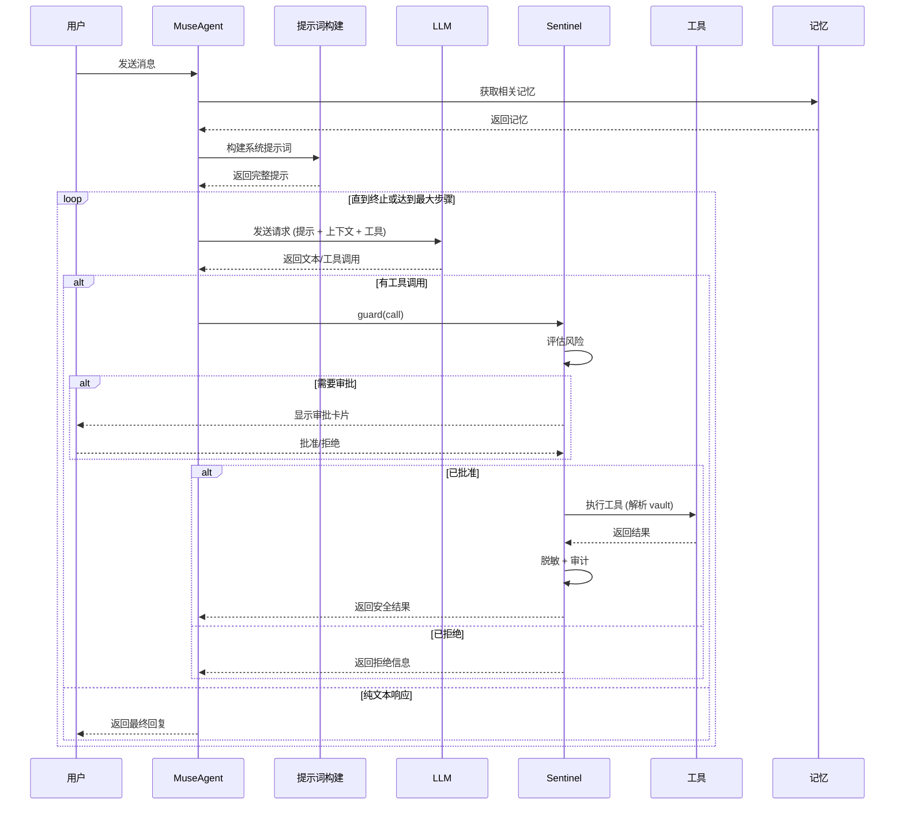
```mermaid
sequenceDiagram
    participant U as 用户
    participant A as MuseAgent
    participant P as 提示词构建
    participant L as LLM
    participant S as Sentinel
    participant T as 工具
    participant M as 记忆

    U->>A: 发送消息
    A->>M: 获取相关记忆
    M-->>A: 返回记忆
    A->>P: 构建系统提示词
    P-->>A: 返回完整提示

    loop 直到终止或达到最大步骤
        A->>L: 发送请求 (提示 + 上下文 + 工具)
        L-->>A: 返回文本/工具调用
        
        alt 有工具调用
            A->>S: guard(call)
            S->>S: 评估风险
            
            alt 需要审批
                S-->>U: 显示审批卡片
                U-->>S: 批准/拒绝
            end
            
            alt 已批准
                S->>T: 执行工具 (解析 vault)
                T-->>S: 返回结果
                S->>S: 脱敏 + 审计
                S-->>A: 返回安全结果
            else 已拒绝
                S-->>A: 返回拒绝信息
            end
        else 纯文本响应
            A-->>U: 返回最终回复
        end
    end
```

### 3.2 Sentinel 安全决策流程

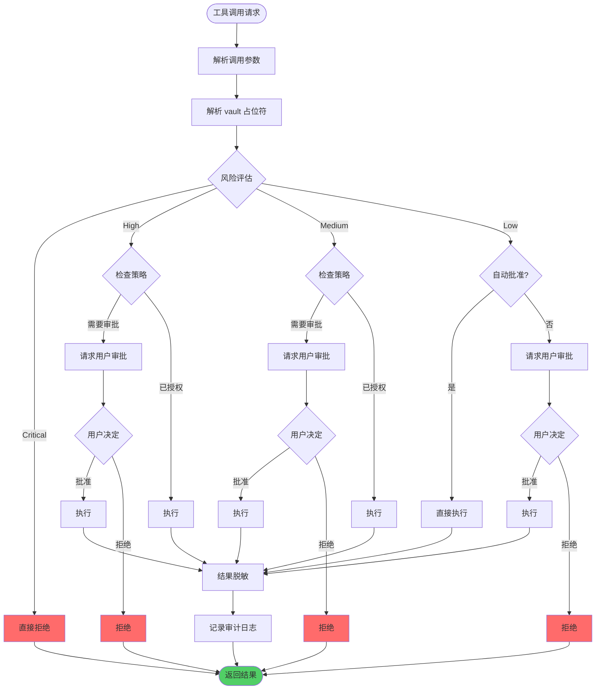
```mermaid
flowchart TD
    Start([工具调用请求]) --> Parse[解析调用参数]
    Parse --> ResolveVault[解析 vault 占位符]
    ResolveVault --> AssessRisk{风险评估}
    
    AssessRisk -->|Critical| Deny1[直接拒绝]
    AssessRisk -->|High| CheckPolicy1{检查策略}
    AssessRisk -->|Medium| CheckPolicy2{检查策略}
    AssessRisk -->|Low| CheckAutoApprove{自动批准?}
    
    CheckPolicy1 -->|需要审批| AskUser1[请求用户审批]
    CheckPolicy1 -->|已授权| Execute1[执行]
    
    CheckPolicy2 -->|需要审批| AskUser2[请求用户审批]
    CheckPolicy2 -->|已授权| Execute2[执行]
    
    CheckAutoApprove -->|是| Execute3[直接执行]
    CheckAutoApprove -->|否| AskUser3[请求用户审批]
    
    AskUser1 --> UserDecision1{用户决定}
    AskUser2 --> UserDecision2{用户决定}
    AskUser3 --> UserDecision3{用户决定}
    
    UserDecision1 -->|批准| Execute4[执行]
    UserDecision1 -->|拒绝| Reject1[拒绝]
    UserDecision2 -->|批准| Execute5[执行]
    UserDecision2 -->|拒绝| Reject2[拒绝]
    UserDecision3 -->|批准| Execute6[执行]
    UserDecision3 -->|拒绝| Reject3[拒绝]
    
    Execute1 --> Redact[结果脱敏]
    Execute2 --> Redact
    Execute3 --> Redact
    Execute4 --> Redact
    Execute5 --> Redact
    Execute6 --> Redact
    
    Redact --> Audit[记录审计日志]
    Audit --> Return([返回结果])
    
    Deny1 --> Return
    Reject1 --> Return
    Reject2 --> Return
    Reject3 --> Return
    
    style Deny1 fill:#ff6b6b
    style Reject1 fill:#ff6b6b
    style Reject2 fill:#ff6b6b
    style Reject3 fill:#ff6b6b
    style Return fill:#51cf66
```

### 3.3 GUI 操作流程 (Hands)

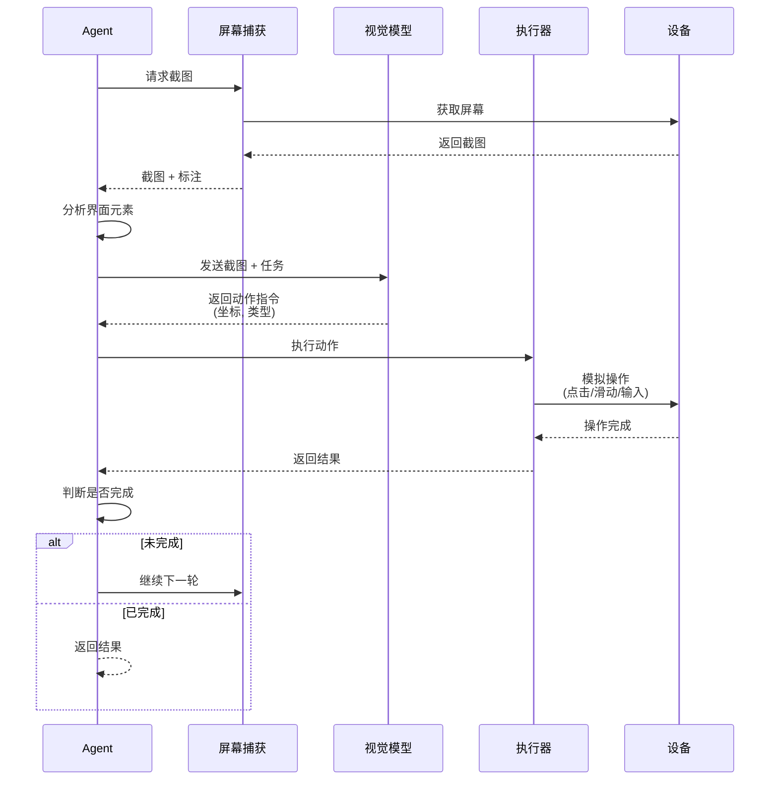
```mermaid
sequenceDiagram
    participant Agent as Agent
    participant Screen as 屏幕捕获
    participant Model as 视觉模型
    participant Executor as 执行器
    participant Device as 设备

    Agent->>Screen: 请求截图
    Screen->>Device: 获取屏幕
    Device-->>Screen: 返回截图
    Screen-->>Agent: 截图 + 标注
    
    Agent->>Agent: 分析界面元素
    Agent->>Model: 发送截图 + 任务
    Model-->>Agent: 返回动作指令<br/>(坐标, 类型)
    
    Agent->>Executor: 执行动作
    Executor->>Device: 模拟操作<br/>(点击/滑动/输入)
    Device-->>Executor: 操作完成
    Executor-->>Agent: 返回结果
    
    Agent->>Agent: 判断是否完成
    
    alt 未完成
        Agent->>Screen: 继续下一轮
    else 已完成
        Agent-->>Agent: 返回结果
    end
```

### 3.4 记忆检索流程

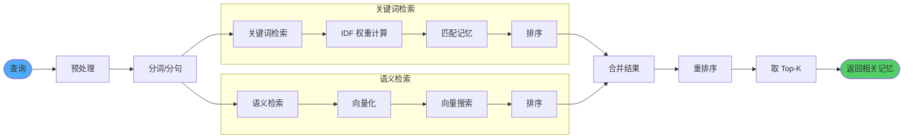
```mermaid
flowchart LR
    Query([查询]) --> Preprocess[预处理]
    Preprocess --> Split[分词/分句]
    
    Split --> Keyword[关键词检索]
    Split --> Semantic[语义检索]
    
    subgraph KeywordSearch["关键词检索"]
        Keyword --> IDF[IDF 权重计算]
        IDF --> Match1[匹配记忆]
        Match1 --> Rank1[排序]
    end
    
    subgraph SemanticSearch["语义检索"]
        Semantic --> Embed[向量化]
        Embed --> VectorSearch[向量搜索]
        VectorSearch --> Rank2[排序]
    end
    
    Rank1 --> Merge[合并结果]
    Rank2 --> Merge
    
    Merge --> Rerank[重排序]
    Rerank --> TopK[取 Top-K]
    TopK --> Result([返回相关记忆])
    
    style Query fill:#4dabf7
    style Result fill:#51cf66
```

---

## 四、核心功能详解

### 4.1 功能架构图

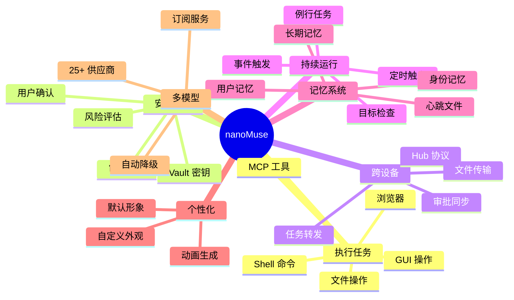
```mermaid
mindmap
  root((nanoMuse))
    执行任务
      Shell 命令
      文件操作
      浏览器
      MCP 工具
      GUI 操作
    安全审批
      风险评估
      用户确认
      审计日志
      Vault 密钥
    跨设备
      Hub 协议
      任务转发
      审批同步
      文件传输
    持续运行
      目标检查
      例行任务
      定时触发
      事件触发
    记忆系统
      身份记忆
      用户记忆
      长期记忆
      心跳文件
    个性化
      默认形象
      自定义外观
      动画生成
    多模型
      25+ 供应商
      订阅服务
      自动降级
```

### 4.2 LLM 提供商选择流程

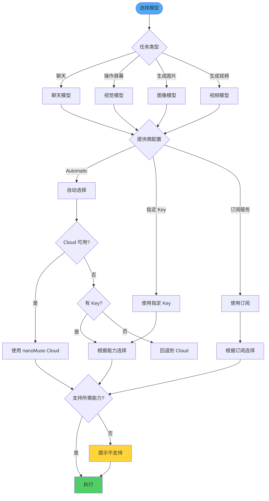
```mermaid
flowchart TD
    Start([选择模型]) --> CheckType{任务类型}
    
    CheckType -->|聊天| ChatModel[聊天模型]
    CheckType -->|操作屏幕| VisionModel[视觉模型]
    CheckType -->|生成图片| ImageModel[图像模型]
    CheckType -->|生成视频| VideoModel[视频模型]
    
    ChatModel --> CheckProvider{提供商配置}
    VisionModel --> CheckProvider
    ImageModel --> CheckProvider
    VideoModel --> CheckProvider
    
    CheckProvider -->|Automatic| AutoSelect[自动选择]
    CheckProvider -->|指定 Key| UseKey[使用指定 Key]
    CheckProvider -->|订阅服务| UseSubscription[使用订阅]
    
    AutoSelect --> TryCloud{Cloud 可用?}
    TryCloud -->|是| UseCloud[使用 nanoMuse Cloud]
    TryCloud -->|否| TryKey{有 Key?}
    
    UseKey --> SelectByKey[根据能力选择]
    UseSubscription --> SelectBySubscription[根据订阅选择]
    
    TryKey -->|是| SelectByKey
    TryKey -->|否| Fallback[回退到 Cloud]
    
    SelectByKey --> CheckCapability{支持所需能力?}
    SelectBySubscription --> CheckCapability
    UseCloud --> CheckCapability
    
    CheckCapability -->|是| Execute[执行]
    CheckCapability -->|否| Warn[提示不支持]
    Warn --> Execute
    
    style Start fill:#4dabf7
    style Execute fill:#51cf66
    style Warn fill:#ffd43b
```

### 4.3 设备间通信流程

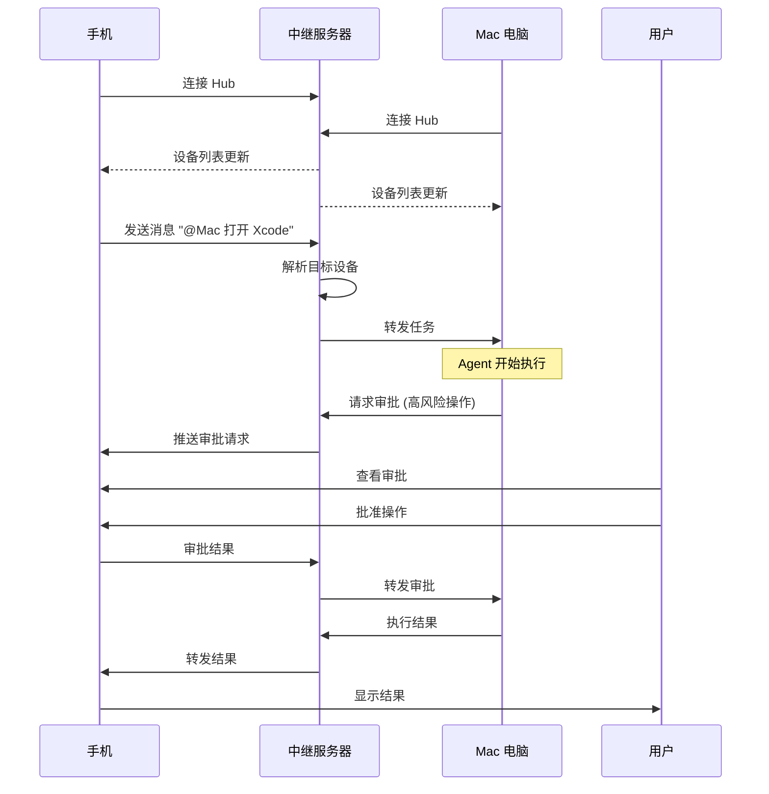
```mermaid
sequenceDiagram
    participant Phone as 手机
    participant Relay as 中继服务器
    participant Mac as Mac 电脑
    participant User as 用户

    Phone->>Relay: 连接 Hub
    Mac->>Relay: 连接 Hub
    Relay-->>Phone: 设备列表更新
    Relay-->>Mac: 设备列表更新
    
    Phone->>Relay: 发送消息 "@Mac 打开 Xcode"
    Relay->>Relay: 解析目标设备
    Relay->>Mac: 转发任务
    
    Note over Mac: Agent 开始执行
    
    Mac->>Relay: 请求审批 (高风险操作)
    Relay->>Phone: 推送审批请求
    
    User->>Phone: 查看审批
    User->>Phone: 批准操作
    Phone->>Relay: 审批结果
    Relay->>Mac: 转发审批
    
    Mac->>Relay: 执行结果
    Relay->>Phone: 转发结果
    Phone->>User: 显示结果
```

---

## 五、数据流图

### 5.1 消息处理数据流

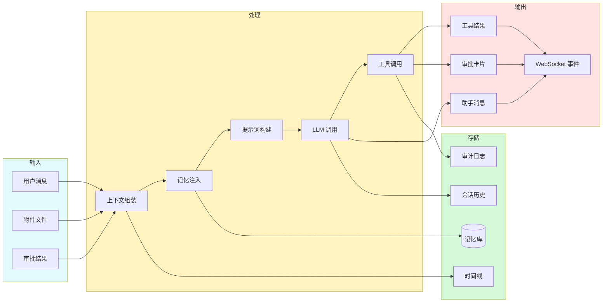
```mermaid
flowchart LR
    subgraph Input["输入"]
        UserMsg[用户消息]
        Files[附件文件]
        Approvals[审批结果]
    end

    subgraph Processing["处理"]
        Context[上下文组装]
        Memory[记忆注入]
        Prompt[提示词构建]
        LLM_Call[LLM 调用]
        Tool_Call[工具调用]
    end

    subgraph Storage["存储"]
        Timeline[时间线]
        Conversation[会话历史]
        AuditLog[审计日志]
        MemoryStore[(记忆库)]
    end

    subgraph Output["输出"]
        AssistantMsg[助手消息]
        ToolResult[工具结果]
        ApprovalCard[审批卡片]
        Events[WebSocket 事件]
    end

    UserMsg --> Context
    Files --> Context
    Approvals --> Context
    
    Context --> Memory
    Memory --> Prompt
    Prompt --> LLM_Call
    LLM_Call --> Tool_Call
    Tool_Call --> ToolResult
    
    LLM_Call --> AssistantMsg
    Tool_Call --> ApprovalCard
    
    Context --> Timeline
    LLM_Call --> Conversation
    Tool_Call --> AuditLog
    Memory --> MemoryStore
    
    AssistantMsg --> Events
    ToolResult --> Events
    ApprovalCard --> Events
    
    style Input fill:#e3fafc
    style Processing fill:#fff3bf
    style Storage fill:#d3f9d8
    style Output fill:#ffe3e3
```

### 5.2 记忆存储数据流

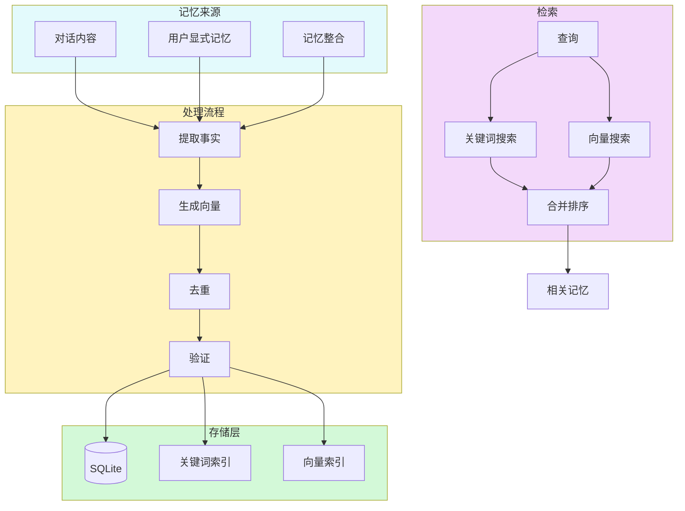
```mermaid
flowchart TD
    subgraph Sources["记忆来源"]
        Conversation[对话内容]
        UserExplicit[用户显式记忆]
        Consolidation[记忆整合]
    end

    subgraph Processing["处理流程"]
        Extract[提取事实]
        Embed[生成向量]
        Dedupe[去重]
        Validate[验证]
    end

    subgraph Storage["存储层"]
        SQLite[(SQLite)]
        Keywords[关键词索引]
        Vectors[向量索引]
    end

    subgraph Retrieval["检索"]
        Query[查询]
        KWS[关键词搜索]
        VSS[向量搜索]
        Merge[合并排序]
    end

    Conversation --> Extract
    UserExplicit --> Extract
    Consolidation --> Extract
    
    Extract --> Embed
    Embed --> Dedupe
    Dedupe --> Validate
    
    Validate --> SQLite
    Validate --> Keywords
    Validate --> Vectors
    
    Query --> KWS
    Query --> VSS
    KWS --> Merge
    VSS --> Merge
    Merge --> Results[相关记忆]
    
    style Sources fill:#e3fafc
    style Processing fill:#fff3bf
    style Storage fill:#d3f9d8
    style Retrieval fill:#f3d9fa
```

---

## 六、部署架构

### 6.1 自托管部署图

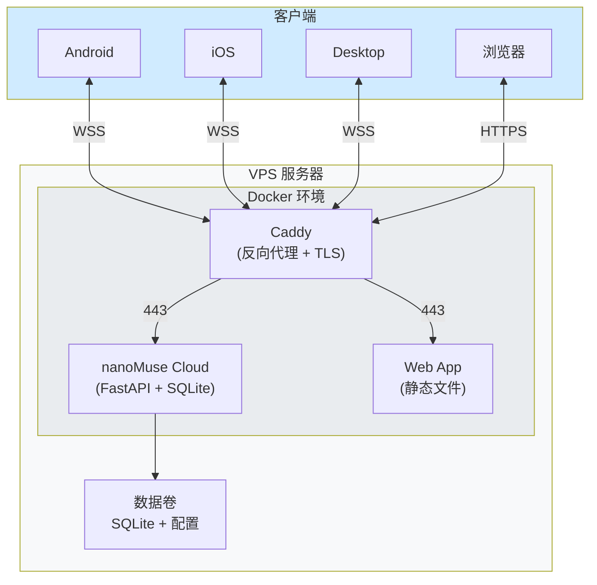
```mermaid
graph TB
    subgraph VPS["VPS 服务器"]
        subgraph Docker["Docker 环境"]
            Relay["nanoMuse Cloud<br/>(FastAPI + SQLite)"]
            WebApp["Web App<br/>(静态文件)"]
            Caddy["Caddy<br/>(反向代理 + TLS)"]
        end
        Volume["数据卷<br/>SQLite + 配置"]
    end

    subgraph Clients["客户端"]
        Android["Android"]
        iOS["iOS"]
        Desktop["Desktop"]
        Browser["浏览器"]
    end

    Caddy -->|443| Relay
    Caddy -->|443| WebApp
    
    Android <-->|WSS| Caddy
    iOS <-->|WSS| Caddy
    Desktop <-->|WSS| Caddy
    Browser <-->|HTTPS| Caddy
    
    Relay --> Volume
    
    style VPS fill:#f8f9fa
    style Docker fill:#e9ecef
    style Clients fill:#d0ebff
```

### 6.2 开发环境结构

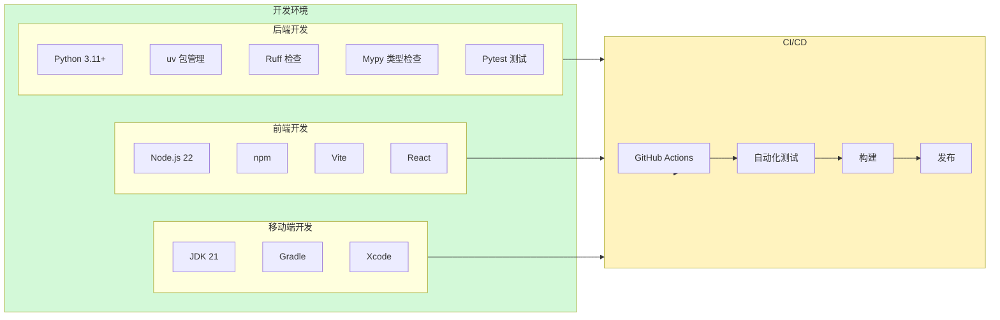
```mermaid
graph LR
    subgraph Dev["开发环境"]
        subgraph Backend["后端开发"]
            Python["Python 3.11+"]
            Uv["uv 包管理"]
            Ruff["Ruff 检查"]
            Mypy["Mypy 类型检查"]
            Pytest["Pytest 测试"]
        end
        
        subgraph Frontend["前端开发"]
            Node["Node.js 22"]
            NPM["npm"]
            Vite["Vite"]
            React["React"]
        end
        
        subgraph Mobile["移动端开发"]
            JDK["JDK 21"]
            Gradle["Gradle"]
            Xcode["Xcode"]
        end
    end

    subgraph CI["CI/CD"]
        GitHub["GitHub Actions"]
        Tests["自动化测试"]
        Build["构建"]
        Release["发布"]
    end

    Backend --> CI
    Frontend --> CI
    Mobile --> CI
    
    CI --> GitHub
    GitHub --> Tests
    Tests --> Build
    Build --> Release
    
    style Dev fill:#d3f9d8
    style CI fill:#fff3bf
```

---

## 七、与竞品对比

### 7.1 架构对比图

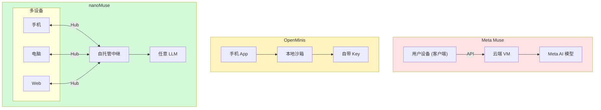
```mermaid
graph TB
    subgraph Meta["Meta Muse"]
        Cloud_VM["云端 VM"]
        Meta_AI["Meta AI 模型"]
        User_Device["用户设备 (客户端)"]
        User_Device -->|API| Cloud_VM
        Cloud_VM --> Meta_AI
    end

    subgraph OpenMinis["OpenMinis"]
        Phone_App["手机 App"]
        Local_Sandbox["本地沙箱"]
        BYO_Key["自带 Key"]
        Phone_App --> Local_Sandbox
        Local_Sandbox --> BYO_Key
    end

    subgraph NanoMuse["nanoMuse"]
        subgraph Devices["多设备"]
            NM_Phone["手机"]
            NM_PC["电脑"]
            NM_Web["Web"]
        end
        NM_Relay["自托管中继"]
        NM_Any_LLM["任意 LLM"]
        
        NM_Phone <-->|Hub| NM_Relay
        NM_PC <-->|Hub| NM_Relay
        NM_Web <-->|Hub| NM_Relay
        NM_Relay --> NM_Any_LLM
    end

    style Meta fill:#ffe3e3
    style OpenMinis fill:#fff3bf
    style NanoMuse fill:#d3f9d8
```

### 7.2 功能对比表

| 特性 | Meta Muse | OpenMinis | nanoMuse |
|------|-----------|-----------|----------|
| **运行位置** | 云端 VM | 手机本地 | 用户设备 + 自托管 |
| **跨设备** | ❌ 无 | ❌ 单设备 | ✅ 多设备协作 |
| **GUI 操作** | ❌ 不支持 | ⚠️ Android 无障碍 | ✅ 屏幕截图 + API |
| **模型** | Meta 模型 | 自带 Key | 免费额度 + 自带 Key |
| **开源** | ❌ 否 | ✅ GPL-3.0 | ✅ GPL-3.0-or-later |
| **隐私** | 云端处理 | 本地 | 本地 + 自托管中继 |
| **记忆** | 有限 | 基础 | ✅ 完整记忆系统 |
| **审批** | 基础 | 基础 | ✅ Sentinel 系统 |

---

## 八、代码结构

### 8.1 项目目录结构

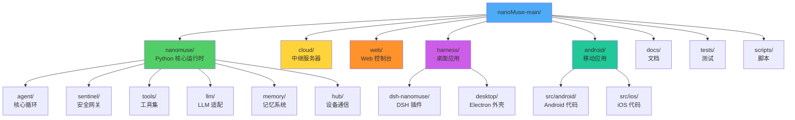
```mermaid
graph TD
    Root["nanoMuse-main/"] --> NanoMuse["nanomuse/<br/>Python 核心运行时"]
    Root --> Cloud["cloud/<br/>中继服务器"]
    Root --> Web["web/<br/>Web 控制台"]
    Root --> Harness["harness/<br/>桌面应用"]
    Root --> Android["android/<br/>移动应用"]
    Root --> Docs["docs/<br/>文档"]
    Root --> Tests["tests/<br/>测试"]
    Root --> Scripts["scripts/<br/>脚本"]
    
    NanoMuse --> NM_Agent["agent/<br/>核心循环"]
    NanoMuse --> NM_Sentinel["sentinel/<br/>安全网关"]
    NanoMuse --> NM_Tools["tools/<br/>工具集"]
    NanoMuse --> NM_LLM["llm/<br/>LLM 适配"]
    NanoMuse --> NM_Memory["memory/<br/>记忆系统"]
    NanoMuse --> NM_Hub["hub/<br/>设备通信"]
    
    Harness --> H_Plugin["dsh-nanomuse/<br/>DSH 插件"]
    Harness --> H_Shell["desktop/<br/>Electron 外壳"]
    
    Android --> A_Android["src/android/<br/>Android 代码"]
    Android --> A_iOS["src/ios/<br/>iOS 代码"]
    
    style Root fill:#4dabf7
    style NanoMuse fill:#51cf66
    style Cloud fill:#ffd43b
    style Web fill:#ff922b
    style Harness fill:#cc5de8
    style Android fill:#20c997
```

### 8.2 类关系图

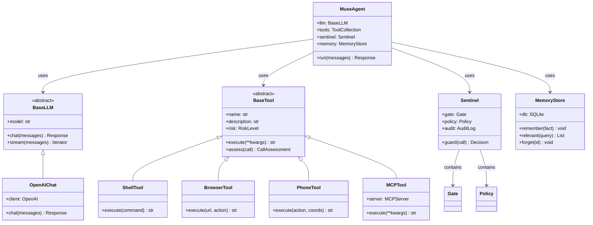
```mermaid
classDiagram
    class BaseTool {
        <<abstract>>
        +name: str
        +description: str
        +risk: RiskLevel
        +execute(**kwargs) str
        +assess(call) CallAssessment
    }
    
    class ShellTool {
        +execute(command) str
    }
    
    class BrowserTool {
        +execute(url, action) str
    }
    
    class PhoneTool {
        +execute(action, coords) str
    }
    
    class MCPTool {
        +server: MCPServer
        +execute(**kwargs) str
    }
    
    class BaseLLM {
        <<abstract>>
        +model: str
        +chat(messages) Response
        +stream(messages) Iterator
    }
    
    class OpenAIChat {
        +client: OpenAI
        +chat(messages) Response
    }
    
    class MuseAgent {
        +llm: BaseLLM
        +tools: ToolCollection
        +sentinel: Sentinel
        +memory: MemoryStore
        +run(messages) Response
    }
    
    class Sentinel {
        +gate: Gate
        +policy: Policy
        +audit: AuditLog
        +guard(call) Decision
    }
    
    class MemoryStore {
        +db: SQLite
        +remember(fact) void
        +relevant(query) List
        +forget(id) void
    }
    
    BaseTool <|-- ShellTool
    BaseTool <|-- BrowserTool
    BaseTool <|-- PhoneTool
    BaseTool <|-- MCPTool
    
    BaseLLM <|-- OpenAIChat
    
    MuseAgent --> BaseLLM : uses
    MuseAgent --> BaseTool : uses
    MuseAgent --> Sentinel : uses
    MuseAgent --> MemoryStore : uses
    
    Sentinel --> Gate : contains
    Sentinel --> Policy : contains
```

---

## 九、路线图

### 9.1 发展路线图

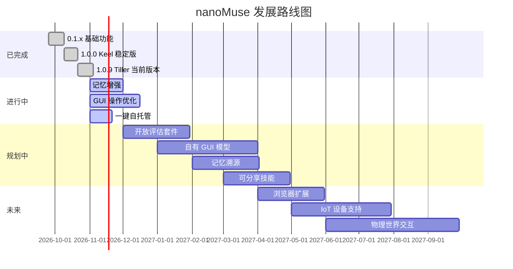
```mermaid
gantt
    title nanoMuse 发展路线图
    dateFormat  YYYY-MM-DD
    section 已完成
    0.1.x 基础功能           :done, 2026-09-25, 2026-10-09
    1.0.0 Keel 稳定版        :done, 2026-10-09, 2026-10-21
    1.0.9 Tiller 当前版本    :done, 2026-10-21, 2026-11-04
    
    section 进行中
    记忆增强                 :active, 2026-11-01, 30d
    GUI 操作优化             :active, 2026-11-01, 45d
    一键自托管               :active, 2026-11-01, 20d
    
    section 规划中
    开放评估套件             :2026-12-01, 60d
    自有 GUI 模型            :2027-01-01, 90d
    记忆溯源                 :2027-02-01, 60d
    可分享技能               :2027-03-01, 60d
    
    section 未来
    浏览器扩展               :2027-04-01, 60d
    IoT 设备支持             :2027-05-01, 90d
    物理世界交互             :2027-06-01, 120d
```

### 9.2 功能优先级矩阵

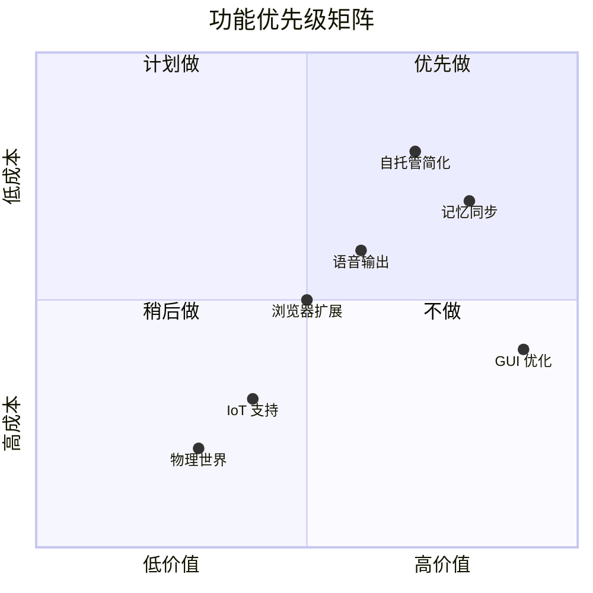
```mermaid
quadrantChart
    title 功能优先级矩阵
    x-axis 低价值 --> 高价值
    y-axis 高成本 --> 低成本
    quadrant-1 优先做
    quadrant-2 计划做
    quadrant-3 稍后做
    quadrant-4 不做
    记忆同步: [0.8, 0.7]
    GUI 优化: [0.9, 0.4]
    语音输出: [0.6, 0.6]
    IoT 支持: [0.4, 0.3]
    自托管简化: [0.7, 0.8]
    浏览器扩展: [0.5, 0.5]
    物理世界: [0.3, 0.2]
```

---

## 十、总结与建议

### 10.1 SWOT 分析

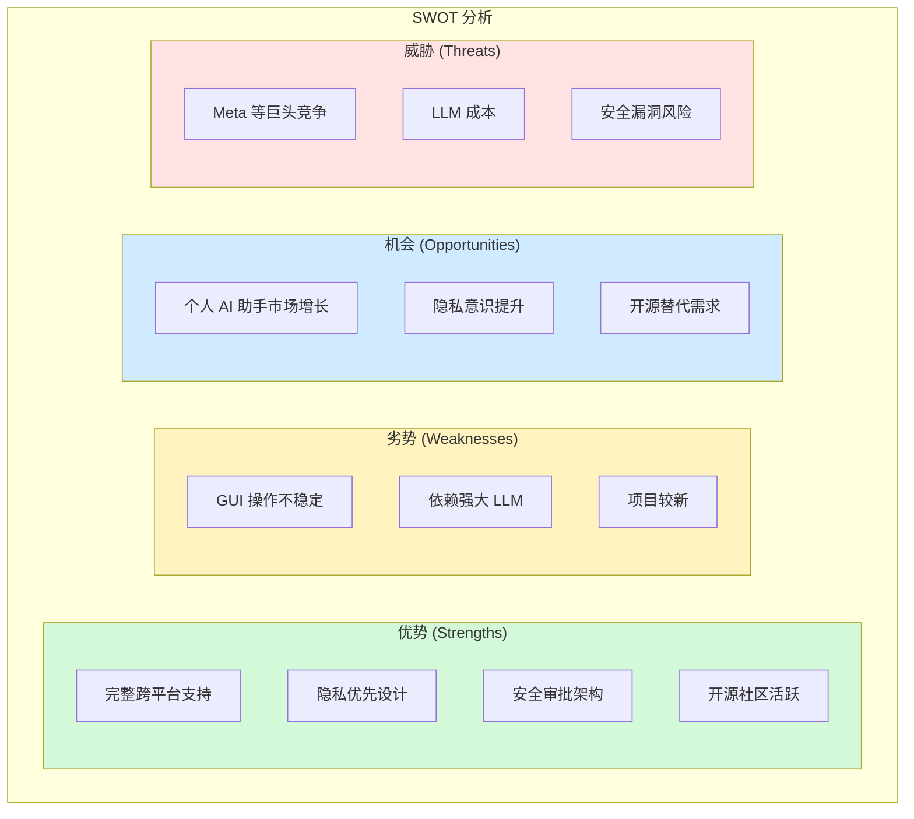
```mermaid
graph TB
    subgraph SWOT["SWOT 分析"]
        subgraph S["优势 (Strengths)"]
            S1[完整跨平台支持]
            S2[隐私优先设计]
            S3[安全审批架构]
            S4[开源社区活跃]
        end
        
        subgraph W["劣势 (Weaknesses)"]
            W1[GUI 操作不稳定]
            W2[依赖强大 LLM]
            W3[项目较新]
        end
        
        subgraph O["机会 (Opportunities)"]
            O1[个人 AI 助手市场增长]
            O2[隐私意识提升]
            O3[开源替代需求]
        end
        
        subgraph T["威胁 (Threats)"]
            T1[Meta 等巨头竞争]
            T2[LLM 成本]
            T3[安全漏洞风险]
        end
    end
    
    style S fill:#d3f9d8
    style W fill:#fff3bf
    style O fill:#d0ebff
    style T fill:#ffe3e3
```

### 10.2 集成建议

对于个人代理扩展项目 (`personal-agent-ext`)，建议：

```mermaid
flowchart LR
    subgraph Borrow["可借鉴"]
        Sentinel["Sentinel 安全架构"]
        Hub["Hub 设备协议"]
        Memory["记忆检索策略"]
        Vault["密钥管理"]
    end
    
    subgraph Integrate["可集成"]
        GUI["GUI 操作模块"]
        MCP["MCP 工具集成"]
        Triggers["触发器系统"]
    end
    
    subgraph Extend["可扩展"]
        NewTools["自定义工具"]
        NewChannels["新聊天渠道"]
        NewDevices["新设备类型"]
    end
    
    Borrow --> Integrate
    Integrate --> Extend
    
    style Borrow fill:#d3f9d8
    style Integrate fill:#d0ebff
    style Extend fill:#f3d9fa
```

### 10.3 关键文件索引

| 功能 | 文件路径 | 说明 |
|------|----------|------|
| Agent 核心 | `nanomuse/agent/core.py` | 主循环、上下文管理 |
| Sentinel | `nanomuse/sentinel/gate.py` | 安全网关 |
| 工具基类 | `nanomuse/tools/base.py` | 工具抽象 |
| LLM 工厂 | `nanomuse/llm/factory.py` | 模型创建 |
| 记忆存储 | `nanomuse/memory/store.py` | SQLite 记忆 |
| Hub 协议 | `nanomuse/hub/` | 设备通信 |
| Web 后端 | `nanomuse/server/api.py` | REST/WebSocket |
| 配置 | `nanomuse/config.py` | Pydantic 配置 |
| 手机操作 | `nanomuse/phone/operator.py` | GUI 操作 |
| 电脑操作 | `nanomuse/computer/operator.py` | 桌面 GUI |

---

## 附录

### A. 相关资源

| 资源 | 链接 |
|------|------|
| 文档站 | https://nanomuse.cn/docs/ |
| 在线 Demo | https://demo.nanomuse.dev/ |
| Discord | https://discord.gg/bkTySmm28X |
| 论文 | https://arxiv.org/abs/2610.08699 |
| GitHub | https://github.com/nano-muse/nanoMuse |

### B. 致谢

nanoMuse 基于以下项目构建：

- **OpenMinis**: 手机 Agent 基础
- **DeepSeek Harness**: 桌面 Agent 框架
- **UI-TARS-desktop**: 桌面 GUI 操作
- **MobileGym / MemGUI-Bench**: 手机操作评估

---

*报告完成 - 包含 Mermaid 架构图、流程图、时序图、类图等可视化内容*
